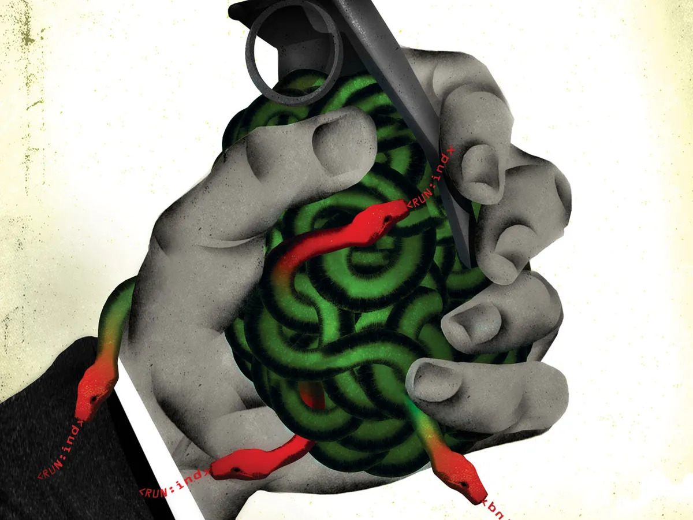

# Stuxnet Virus

## Introduction to Stuxnet

Stuxnet is a sophisticated piece of malware discovered in 2010 that marked a turning point in cybersecurity. Unlike typical viruses, Stuxnet was designed to target industrial control systems (ICS), specifically those used in Iran’s nuclear program. It is widely believed to have been developed by the United States and Israel to sabotage Iran's uranium enrichment capabilities.

Stuxnet's precision and complexity make it particularly notable. It was the first malware known to specifically target physical infrastructure, demonstrating how cyber weapons can have tangible effects in the real world. By exploiting multiple zero-day vulnerabilities in Windows systems, Stuxnet infiltrated and manipulated Siemens PLCs (Programmable Logic Controllers), which are critical for controlling industrial processes, causing centrifuges in Iran’s Natanz facility to spin out of control while reporting normal operations.

The discovery of Stuxnet exposed a new frontier in cyber warfare and raised awareness about vulnerabilities in critical infrastructure worldwide.

## Technical Operation of Stuxnet

Stuxnet was engineered with the clear objective of sabotaging Iran's nuclear enrichment program by targeting industrial control systems at its Natanz facility.

### Vulnerabilities Exploited

Stuxnet exploited several zero-day vulnerabilities in Microsoft Windows, including:
- **Vulnerability A:** Targeted a flaw in the Windows Print Spooler service, allowing Stuxnet to execute code with elevated privileges.
- **Vulnerability B:** Exploited a flaw in the Windows Shell to execute arbitrary code and spread the infection.
- **Vulnerability C:** Exploited a flaw in the Windows kernel that allowed Stuxnet to execute code without user interaction.
- **Vulnerability D:** Allowed the malware to bypass security measures by exploiting vulnerabilities in system services.

### Infection and Propagation

- **Initial Infection Vector:** Stuxnet initially spread via infected USB drives, which were introduced into the target network.
- **Propagation Mechanism:** Once inside the network, Stuxnet used network shares and autorun files to propagate further, avoiding detection by conventional security measures.

### Payload and Execution

- **PLC Manipulation:** Stuxnet specifically targeted the Siemens S7-300 PLCs, which are used to control industrial processes. The malware altered the PLC’s instructions to change the speed of the centrifuges, manipulating their rotational speeds to cause damage. It used sophisticated programming techniques to avoid detection and ensure that the modifications were only applied under specific conditions, such as particular configurations and operational states of the PLCs.
- **Impact on Centrifuges:** The malware caused the centrifuges to spin at varying speeds, creating mechanical stress that ultimately led to their physical destruction. The damage was carefully orchestrated to ensure that while the centrifuges were failing, the control systems and monitoring software reported normal operation, thus delaying the discovery of the sabotage.

## Video Overview

Below is a video that explains Stuxnet in detail:

<iframe width="560" height="315" src="https://www.youtube.com/embed/wmWGtDeoW-0?si=MNGUi8MUzOWrswaq" title="YouTube video player" frameborder="0" allow="accelerometer; autoplay; clipboard-write; encrypted-media; gyroscope; picture-in-picture; web-share" referrerpolicy="strict-origin-when-cross-origin" allowfullscreen></iframe>

***Video Credit:*** *This video was published by [Train GRC Academy](https://www.youtube.com/@traingrcacademy) on YouTube.*

## Impact and Consequences

Stuxnet’s discovery marked a new era where cyber operations could cause physical damage. As the first documented instance of such a precise cyber weapon, Stuxnet not only disrupted Iran’s nuclear ambitions but also redefined modern conflict.

It exposed vulnerabilities within critical infrastructure systems globally, compelling governments and industries to reassess their cybersecurity frameworks. The operation increased tensions between Iran and Western powers and challenged existing legal frameworks concerning cyber warfare.

### Key Events

- **2005:** Development of Stuxnet begins, targeting Iran’s nuclear facilities.
- **2007:** Stuxnet is tested in a controlled environment.
- **2009:** Stuxnet is deployed in the Natanz facility.
- **2010:** Stuxnet is discovered by cybersecurity experts, revealing its sophisticated nature.
- **2011-2012:** Detailed analysis of Stuxnet’s impact and the beginning of public disclosures.
- **2013:** Stuxnet’s source code is leaked, leading to widespread analysis and understanding of its design.
- **2014:** The term "Stuxnet Effect" is coined to describe the implications of the attack on cyber warfare.

## Technical Details and Analysis

### Vulnerabilities Exploited

Stuxnet exploited several zero-day vulnerabilities in Microsoft Windows, including:
- **Vulnerability A:** Flaw in Windows Print Spooler.
- **Vulnerability B:** Flaw in Windows Shell.
- **Vulnerability C:** Flaw in Windows kernel.
- **Vulnerability D:** Flaw in system services.

### Infection and Propagation

- **Initial Infection Vector:** Infected USB drives.
- **Propagation Mechanism:** Network file sharing and email attachments.

### Payload and Execution

- **PLC Manipulation:** Stuxnet used advanced programming techniques to manipulate the Siemens PLCs, altering centrifuge operations. It included sophisticated routines to monitor and adjust the operational speeds, ensuring maximum disruption while avoiding detection.
- **Impact on Centrifuges:** Analysis of the specific changes made to centrifuge operations and their impact on the physical machinery.

## Countermeasures and Mitigations

### Preventive Measures

- **System Updates:** Regular patching and updates are crucial to address known vulnerabilities and protect systems from exploitation.
- **Network Segmentation:** Implementing network segmentation to isolate critical infrastructure from less secure networks. This approach limits the potential spread of malware within industrial systems.
- **Endpoint Protection:** Use advanced endpoint protection solutions that include behavior-based detection and response capabilities.

### Response Strategies

- **Incident Response Plan:** Develop and regularly update a comprehensive incident response plan that includes specific procedures for handling cyber attacks on industrial systems. The plan should include clear roles and responsibilities, communication protocols, and recovery strategies.
- **Forensic Analysis:** Techniques for investigating cyber incidents include:
  - **Log Analysis:** Reviewing system and network logs to trace the malware’s activities and origins.
  - **Network Traffic Examination:** Analyzing network traffic to identify unusual patterns and communication with command-and-control servers.
  - **Malware Analysis:** Dissecting the malware to understand its components, behavior, and propagation methods.

## Ethical and Legal Considerations

### Ethical Implications

- **Use of Cyber Weapons:** The use of cyber weapons raises complex moral questions regarding their role in statecraft and potential for unintended consequences. The deployment of cyber tools like Stuxnet introduces significant ethical concerns about the balance between achieving strategic objectives and causing collateral damage.
- **Collateral Damage:** The potential for unintended harm to civilian infrastructure and the broader implications for global security are major concerns. The Stuxnet attack illustrated the risk of cyber operations impacting non-targeted systems and the need for robust ethical guidelines.

### Legal Framework

- **International Laws:** Overview of international laws governing cyber warfare:
  - **The Geneva Conventions:** Address the conduct of war and protection of civilians, though their applicability to cyber warfare is limited and requires adaptation.
  - **The Tallinn Manual:** A comprehensive guide on how international law applies to cyber conflicts, providing a framework for analyzing and responding to cyber warfare scenarios.
- **National Legislation:** Examination of how different countries address cyber weapons and their use:
  - **The U.S. Computer Fraud and Abuse Act (CFAA):** Addresses unauthorized access to computers and networks, setting legal precedents for prosecuting cyber crimes.
  - **The European Union’s General Data Protection Regulation (GDPR):** Includes provisions for data protection and breach notification, influencing how organizations handle data security and privacy.

## Future Trends and Developments

### Emerging Threats

- **Advanced Persistent Threats (APTs):** APTs are evolving with increasing sophistication. Future threats may leverage AI and machine learning to enhance their stealth, persistence, and impact. Organizations must stay vigilant against these threats by investing in advanced threat detection and response technologies.
- **IoT Vulnerabilities:** As the Internet of Things (IoT) devices become more prevalent, their security risks are growing. IoT devices often have weaker security measures, making them attractive targets for exploitation. Addressing these vulnerabilities requires a proactive approach to IoT security, including strong authentication, encryption, and regular updates.

### Defense Innovations

- **AI and Machine Learning:** AI and machine learning technologies are increasingly used to improve threat detection, automate responses, and enhance overall cybersecurity. These technologies can analyze vast amounts of data to identify patterns and anomalies indicative of cyber threats, enabling more effective defense mechanisms.
- **Collaborative Defense:** International cooperation and information sharing are crucial in combating cyber threats. Initiatives like the Cybersecurity Information Sharing Act (CISA) in the U.S. promote collaboration between public and private sectors to improve threat intelligence and response capabilities. Developing collective defense strategies involves sharing threat data, best practices, and incident response techniques among nations and organizations.

