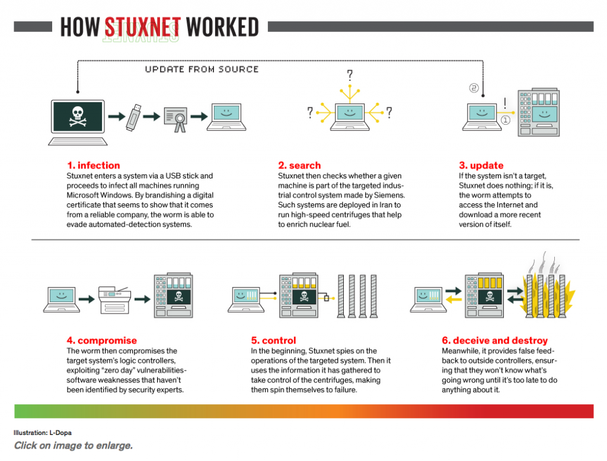

Text can be **bold**, _italic_, or ~~strikethrough~~.

[Link to another page](./another-page.html).

There should be whitespace between paragraphs.

There should be whitespace between paragraphs. We recommend including a README, or a file with information about your project.

# Stuxnet virus
# Introduction to Stuxnet

Stuxnet is a sophisticated piece of malware discovered in 2010 that marked a turning point in the realm of cybersecurity. Unlike typical viruses, Stuxnet was designed to target industrial control systems, specifically those used in Iran’s nuclear program. It is widely believed to have been developed by the United States and Israel in a joint effort to sabotage Iran's uranium enrichment capabilities.

What makes Stuxnet particularly notable is its precision and complexity. It was the first known malware to specifically target physical infrastructure, demonstrating how cyber weapons can have tangible effects in the real world. By exploiting multiple zero-day vulnerabilities in Windows systems, Stuxnet was able to infiltrate and manipulate Siemens PLCs (Programmable Logic Controllers), causing the centrifuges in Iran’s Natanz facility to spin out of control while reporting normal operations to the monitoring systems.

The discovery of Stuxnet not only exposed a new frontier in cyber warfare but also raised awareness about the vulnerabilities in critical infrastructure worldwide. It remains a key example of how digital tools can be weaponized in geopolitical conflicts.

## Technical Operation


Stuxnet stands out for its sophisticated and targeted approach, designed not just to infiltrate but to precisely disrupt specific industrial processes. Unlike conventional malware that typically spreads indiscriminately, Stuxnet was engineered with a clear objective: to sabotage Iran's nuclear enrichment program by targeting the industrial control systems at its Natanz facility.

The malware exploited multiple zero-day vulnerabilities in Microsoft Windows, allowing it to spread stealthily across networks. Its true brilliance, however, lay in its ability to identify and manipulate Siemens PLCs (Programmable Logic Controllers). These controllers are integral to the operation of industrial equipment, and in this case, they managed the centrifuges critical to uranium enrichment.

Stuxnet was able to subtly alter the functioning of these centrifuges, causing them to deviate from their normal operational speeds. By doing so, it induced mechanical stress that could eventually lead to their failure. Simultaneously, the malware fed false data to the monitoring systems, ensuring that operators believed everything was functioning correctly. This dual strategy of physical disruption combined with digital deception allowed Stuxnet to cause significant damage without immediate detection.

The technical sophistication of Stuxnet set a new benchmark in cyber warfare, demonstrating how digital attacks can have real-world consequences by specifically targeting and disrupting critical infrastructure.

### Header 3

```js
// Javascript code with syntax highlighting.
var fun = function lang(l) {
  dateformat.i18n = require('./lang/' + l)
  return true;
}
```

```ruby
# Ruby code with syntax highlighting
GitHubPages::Dependencies.gems.each do |gem, version|
  s.add_dependency(gem, "= #{version}")
end
```

#### Header 4

*   This is an unordered list following a header.
*   This is an unordered list following a header.
*   This is an unordered list following a header.

##### Header 5

1.  This is an ordered list following a header.
2.  This is an ordered list following a header.
3.  This is an ordered list following a header.

###### Header 6

| head1        | head two          | three |
|:-------------|:------------------|:------|
| ok           | good swedish fish | nice  |
| out of stock | good and plenty   | nice  |
| ok           | good `oreos`      | hmm   |
| ok           | good `zoute` drop | yumm  |

### There's a horizontal rule below this.

* * *

### Here is an unordered list:

*   Item foo
*   Item bar
*   Item baz
*   Item zip

### And an ordered list:

1.  Item one
1.  Item two
1.  Item three
1.  Item four

### And a nested list:

- level 1 item
  - level 2 item
  - level 2 item
    - level 3 item
    - level 3 item
- level 1 item
  - level 2 item
  - level 2 item
  - level 2 item
- level 1 item
  - level 2 item
  - level 2 item
- level 1 item

### Small image


### Large image




### Definition lists can be used with HTML syntax.

<dl>
<dt>Name</dt>
<dd>Godzilla</dd>
<dt>Born</dt>
<dd>1952</dd>
<dt>Birthplace</dt>
<dd>Japan</dd>
<dt>Color</dt>
<dd>Green</dd>
</dl>

```
Long, single-line code blocks should not wrap. They should horizontally scroll if they are too long. This line should be long enough to demonstrate this.
```

```
The final element.
```
